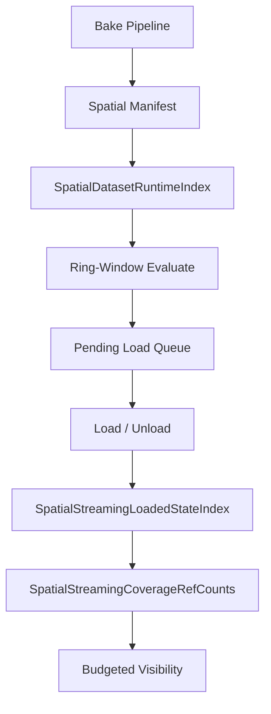

# Spatial Streaming HLOD Optimization

## Project overview

**Spatial Streaming** loads a baked city dataset in concentric LOD rings around the camera. The bake pipeline emits `spatial_manifest.json` with 1 km tiles, optional subcells, tile/subcell proxies, and HLOD2/HLOD4 supertiles. At runtime, `SpatialStreamingController` evaluates which blocks are *wanted*, queues bundle loads, and applies **substitution rules** so coarser geometry stays visible until finer layers are ready.

Cascade (coarse → fine):

```
HLOD4 (4×4 km) → HLOD2 (2×2 km) → tile proxy → subcell proxy → detail
```

## Problem (800+ tiles)

Before optimization, each check interval (~0.35 s) could:

- Scan **all manifest tiles** and **all supertiles** for want/pending decisions — O(dataset size).
- Resolve camera tile by **linear search** over hundreds of tiles.
- Walk **all loaded records** for detail/proxy/HLOD substitution and coverage checks.
- Recursively re-check child coverage when deciding HLOD visibility.

With 800+ tiles this produced **20–35 ms `SpatialStreaming.Evaluate` spikes** even when the camera barely moved, and amplified load/visibility cost at scale.

## Architecture (after optimization)



### Key runtime types

| Type | Role |
|------|------|
| `SpatialDatasetRuntimeIndex` | O(1) tile/supertile/subcell lookup; ring-window collection; camera grid resolution |
| `SpatialStreamingHlodEvaluator` | Ring-window want/pending evaluation (not full manifest scan) |
| `SpatialStreamingLoadedStateIndex` | Per-tile detail/proxy bitmasks, in-flight counts, HLOD block maps |
| `SpatialStreamingCoverageRefCounts` | Incremental HLOD4→HLOD2→1 km readiness |
| `SpatialStreamingHlodDag` | Tile ↔ parent/child HLOD relationships |
| `SpatialStreamingLodSubstitution` | Substitution + load priority rules |
| `SpatialStreamingRingCoverage` | Visibility coverage queries (uses ref counts when available) |
| `SpatialStreamingController` | Orchestrates evaluate, load budgets, visibility, cleanup |

## Phases

### Phase A — Spatial index foundation

**Goal:** Address tiles and supertiles by grid/block, not list scans.

**Implemented:**

- `SpatialDatasetRuntimeIndex.Build(manifest)` on `LoadManifest()`.
- Packed grid keys, supertile block keys, subcell maps, parent HLOD links.
- `TryResolveCameraTileGrid` O(1) from world position + grid bounds.
- `CollectTilesInRing` / `CollectSupertilesInRing` for ring-window iteration.
- Wired through `BuildLodContext()` and `SpatialStreamingTileRingUtility`.

**Benefits:** Camera tile lookup O(1); supertile lookup O(1); shared index layer for later phases.

### Phase B — Ring-window evaluation

**Goal:** Scale evaluate cost with configured ring radius, not total tile count.

**Implemented:**

- `SpatialStreamingHlodEvaluator` iterates `CollectTilesInRing` / `CollectSupertilesInRing`.
- Controller reuses `_evaluateWantScratch`, `_evaluatePendingKeysScratch`, `_evaluatedPendingScratch`.
- `ShouldRunStreamingEvaluate()` triggers full evaluate on **grid-cell change** or significant camera move; idle ticks skip full evaluate (cleanup/unloads still run every frame).

**Benefits:** Evaluate O(ring²) ≈ 10–15 tiles across vs O(800+). Standing still in one tile avoids evaluate churn.

### Phase C — Loaded-state indexes

**Goal:** Replace loaded-record scans with incremental state on load/unload.

**Implemented:**

- `SpatialStreamingLoadedStateIndex`: detail/proxy bitmasks per tile (4×4 subcell slots), tile proxy flag, detail in-flight, HLOD2/HLOD4 block dictionaries.
- `RegisterLoadedRecordIndexes` / `UnregisterLoadedRecordIndexes` update loaded state + coverage.
- `SpatialStreamingLodSubstitution` prefers loaded state for `IsDetailLoaded`, `IsTileDetailComplete`, `CountDetailInFlightForTile`, etc.
- Controller helpers (`IsTileDetailComplete`, `CountLoadedDetailSubcellsForTile`) delegate to loaded state.

**Benefits:** Hot substitution/coverage paths O(1) or O(subcells per tile), not O(all loaded blocks).

### Phase D — Hierarchical coverage + advanced LOD

**Goal:** O(1) coverage queries; optional AAA-style prioritization behind toggles.

**Implemented:**

- `SpatialStreamingCoverageRefCounts` + `SpatialStreamingHlodDag`.
- `SpatialStreamingRingCoverage` uses `ctx.Coverage` for `Hlod2BlockFullyCoveredByOneKm` / `Hlod4BlockFullyCoveredByHlod2` when available.
- **Optional** (inspector on `SpatialStreamingController`):
  - `_useScreenSpaceLodPriority` — sort pending loads by projected screen size (`SpatialStreamingLodMetrics`).
  - `_useTimeSlicedEvaluate` — rotate through large ring windows across frames.
  - `_maxResidentBlocks` — LRU-style eviction via `SpatialStreamingResidencyBudget`.

**Benefits:** Visibility/coverage decisions amortized after load events; path to screen-space selection without discarding ring policy.

## Data flow

### Evaluate (check interval)

1. `ShouldRunStreamingEvaluate()` — grid crossing / movement / first load / expired retry keys.
2. `BuildLodContext()` — manifest + runtime index + loaded state + coverage + DAG.
3. `SpatialStreamingHlodEvaluator.Evaluate` — ring window only.
4. `MergePendingList` → `BeginEvaluateCleanup` (budgeted supersede/unload queue).
5. Optional `SpatialStreamingResidencyBudget.EnforceBudget`.

No synchronous `SetActive` / destroy in evaluate; unloads go through `ProcessPendingUnloads`.

### Load

1. `ProcessPendingLoads` — budgeted coroutines.
2. `LoadBlockCoroutine` → register loaded state → enqueue visibility keys.
3. Incremental `ProcessVisibilityQueue` / budgeted `UpdateLodVisibility`.

### Visibility

`SpatialStreamingLodSubstitution.ShouldRenderRecord` + `SpatialStreamingRingCoverage` (ref-count fast path when `ctx.Coverage` is set).

## Profiling checklist

Profile in `Scenes/Spacial Streaming.unity` with the same camera path before/after.

| Marker | Expectation |
|--------|-------------|
| `SpatialStreaming.Evaluate` | Drops from O(all tiles) to O(ring²); near-zero when idle in same grid cell |
| `SpatialStreaming.EvaluateCleanup` | Stays budgeted (~24 records/frame) |
| `SpatialStreaming.UpdateLodVisibility` | Budgeted full refresh (32 records/frame) |
| `SpatialStreaming.ProcessVisibilityQueue` | Small incremental work during loads |
| `SpatialStreaming.ProcessPendingUnloads` | ≤4 unloads/frame |
| `SpatialStreamingController.LoadBlockCoroutine` | Unchanged per-load cost; fewer evaluate-triggered spikes |

**Should disappear:** full-manifest tile loops in evaluate; repeated prefix scans over `_loaded` in hot substitution paths.

**Tune:** `_checkInterval`, ring counts, `VisibilityWorkBudgetPerFrame`, `_maxResidentBlocks`, advanced LOD toggles.

## Visual invariants

- No empty detail-only rings (coarse remains until fine coverage ready).
- No HLOD/detail/proxy overlap after budgets settle.
- Detail commits do not deadlock waiting for superseded proxies.
- Coarse HLOD hides only when child layer reports ready (coverage ref counts or fallback walk).

## Data invariants (debug)

- `SpatialDatasetRuntimeIndex.TileCount` == manifest tile count after load.
- Loaded-state bitmasks match `_loaded` after each load/unload (compare in custom debug if needed).
- Coverage ref counts never negative; HLOD2 ready implies 4 child 1 km layers ready per DAG.

## Re-bake and compatibility

- **No manifest schema change required** for Phases A–C: indexes are built at runtime from existing manifest fields (`tileId`, `left`/`bottom`, `ChildTileIds`, subcell `gridX`/`gridY`).
- Re-bake when changing proxy hints, bundle layout, or when future bake emits optional LOD metric metadata for screen-space error.
- Existing scenes and `SpatialBakeProfile` remain compatible; advanced toggles default off.

## How implemented (file map)

| Area | Files |
|------|--------|
| Runtime index | `SpatialStreaming/Runtime/SpatialDatasetRuntimeIndex.cs` |
| Ring evaluate | `SpatialStreaming/Runtime/SpatialStreamingHlodEvaluator.cs` |
| Loaded state | `SpatialStreaming/Runtime/SpatialStreamingLoadedStateIndex.cs` |
| Coverage | `SpatialStreamingRingCoverage.cs` (`SpatialStreamingCoverageRefCounts`) |
| DAG | `SpatialDatasetRuntimeIndex.cs` (`SpatialStreamingHlodDag`) |
| Controller wiring | `SpatialStreaming/Runtime/SpatialStreamingController.cs` |
| Substitution | `SpatialStreaming/Runtime/SpatialStreamingLodSubstitution.cs` (also `SpatialStreamingLodMetrics`, `SpatialStreamingResidencyBudget`, `SpatialStreamingEvaluateSliceState`) |
| Camera/grid | `SpatialStreamingTileRingUtility.cs` |

## Rollout order

1. **A + B** — largest check-interval win; lowest risk.
2. **C** — required for cheap coverage/substitution at scale.
3. **D** — ref-count coverage + optional advanced toggles; baseline ring behavior unchanged when toggles off.
